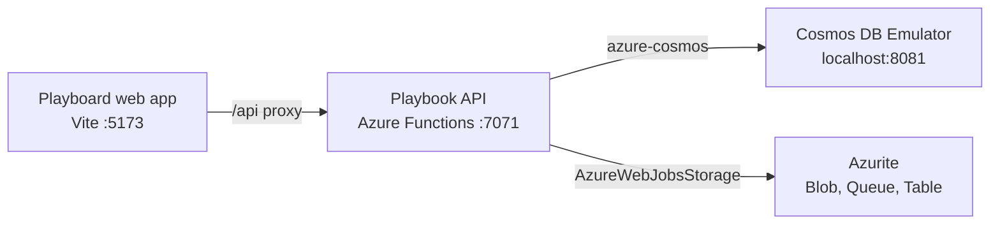

# Azure Debug Plan

> This plan is the source of truth for generating the
> VS Code debug setup in this workspace.
>
> **Status:** Executing
> **Execution Mode:** Guided
> **Created:** 2026-09-24T11:49:57-04:00
> **Last Updated:** 2026-09-25T18:30:00-04:00
>
> <!-- Guided Mode (default) - hand-holds the user through review and approval before generating. -->

---

## Prerequisites

| Tool / Extension | Category | Service(s) | Installed | Version |
|------------------|----------|------------|-----------|---------|
| Node.js | Runtime | frontend | ✅ | v24.14.1 |
| npm | Package manager | frontend | ✅ | 11.11.0 |
| Python | Runtime | api | ✅ | 3.11.9 (`py` launcher) |
| pip | Package manager | api | ✅ | 24.0 (`py -m pip`) |
| Azure Functions Core Tools | Runtime | api | ✅ | 4.15.1 |
| Docker | Container runtime | api | ✅ | 29.8.0 |
| Docker Compose | Compose provider | api | ✅ | v5.5.1 |
| Chrome | Browser | frontend | ✅ | 153.0.8010.54 |
| `ms-azuretools.vscode-azurefunctions` | VS Code extension | api | ✅ | 1.22.1 |

> ℹ️ **Current verification:** Docker is installed and the Docker engine is running. Chrome is installed and available at `C:\Program Files (x86)\Google\Chrome\Application`, so the frontend browser prerequisite is satisfied.

---

## Debug Configurations

Each checked row below produces a VS Code debug configuration in `.vscode/launch.json`.

| Generate | Debug Config Name | Service Label | Service Root | Project Type | Runtime | Version | Azure Dependencies |
|----------|--------------------|---------------|--------------|--------------|---------|---------|---------------------|
| [x] | Playbook API (debug) | Playbook API | ./api | functions | Python | 3.11.x | Azure Cosmos DB, Azure Storage |
| [x] | Playboard web app (debug) | Playboard web app | ./frontend | frontend-spa | Node.js | 24.x | — |
| [x] | Debug All Services | Debug All Services | | *Compound Config* | | | |

ℹ️ Project Type Descriptions

| Project Type | Description |
|-------------|-------------|
| functions | Azure Functions serverless compute with HTTP triggers and the Python v2 programming model |
| frontend-spa | Single-page application served by a Vite development server and debugged in a Chromium browser |
| *Compound Config* | Starts the backend and frontend debug configurations together in dependency order |

> ℹ️ **Proxy detected:** The frontend Vite server proxies `/api` requests to the Playbook API at `http://127.0.0.1:7071`. The compound configuration should start the API before the frontend.

---

## Orchestrator

| Orchestrator | Container Runtime | Compose Command | Description |
|-------------|-------------------|-----------------|-------------|
| Docker Compose | Docker | `docker compose` | Runs the local Cosmos DB and Azurite emulator containers. Docker Desktop is installed; start its engine before running the generated tasks. |

---

## Emulators

| Dependent Service | Emulator | Purpose |
|-------------------|----------|---------|
| Azure Storage | Azurite Container | Provides local Blob, Queue, and Table Storage endpoints for `AzureWebJobsStorage` and future storage adapters. Existing Azurite data files were detected in the workspace. |
| Azure Cosmos DB | Cosmos DB Emulator | Provides the local Cosmos DB NoSQL endpoint configured by `COSMOS_ENDPOINT`, including the `coaches-playboard` database and `playboard` container. |

---

## Architecture Diagram

During debugging, the compound VS Code configuration starts the Python Functions API and Vite frontend; the API connects to local Cosmos DB and Azurite containers, while Vite proxies browser API requests to the Functions host.

---

## Migrations

The API uses an explicit versioned Cosmos DB schema definition and adapter updates; no ORM migration runner or seed data is present.

| Generate | Service | Migration Tool |
|----------|---------|---------------|
| [x] | Playbook API | Versioned Cosmos DB schema (`./api/migrations/001-storage-schema.json`) |

---

## API Test Collections

When selected, the generation phase produces lightweight, runnable API test scripts for smoke testing after the local services and emulators launch.

| Generate | Service | Description |
|----------|---------|-------------|
| [x] | Playbook API | 

HTTP Endpoints (20)
 GET /api/health GET /api/search GET /api/playbooks POST /api/playbooks GET /api/playbooks/{playbookId} PATCH /api/playbooks/{playbookId} DELETE /api/playbooks/{playbookId} GET /api/playbooks/{playbookId}/plays POST /api/playbooks/{playbookId}/plays GET /api/playbooks/{playbookId}/plays/{playId} PATCH /api/playbooks/{playbookId}/plays/{playId} DELETE /api/playbooks/{playbookId}/plays/{playId} GET /api/playbooks/{playbookId}/slides POST /api/playbooks/{playbookId}/slides GET /api/playbooks/{playbookId}/slides/{slideId} PATCH /api/playbooks/{playbookId}/slides/{slideId} DELETE /api/playbooks/{playbookId}/slides/{slideId} POST /api/exports GET /api/exports/{id} OPTIONS /api/{*path}  

Triggers (1)
 HTTP wildcard trigger: `{*path}`
 |

---

## Convenience Scripts

The existing frontend scripts are retained as the local development entry points; emulator lifecycle and compound startup should be represented by generated VS Code tasks so existing package configuration is preserved.

| Generate | Script | Registered In | Description |
|----------|--------|---------------|-------------|
| [x] | dev | ./frontend/package.json | Start the Vite frontend on the local development port with the configured `/api` proxy. |
| [x] | build | ./frontend/package.json | Build the frontend production bundle. |
| [x] | lint | ./frontend/package.json | Run the existing frontend lint check. |
